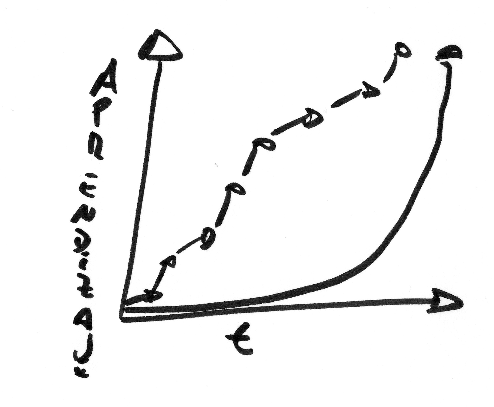

El espíritu de Scrum
====================
Una mirada orgánica sobre el mundo del trabajo
----------------------------------------------

Por Alan Cyment
# Parte 1: Por qué scrum
## ¿Cómo trabajamos hoy?

Este libro se trata sobre el trabajo. Sobre cómo nos organizamos para
trabajar, hacer, producir. Queremos reflexionar sobre cómo encaramos nuestro trabajo y soñar alternativas. Alternativas contrastantes, radicalmente distintas. Pero para eso es necesario hacer primero un poco de introspección. Este libro intenta convertirse en una pausa, un espacio, una posibilidad. Un momento no para trabajar, pero sí para pensar el trabajo.

### ¿Cómo me siento el domingo a la noche?
Baja el sol, es domingo, el fin de semana se aleja sin aún haber partido. Arrecia la melancolía, irrumpe el lunes, con su lógica de rendimiento, tedio e inercia. Algo no funciona, pero estamos acostumbrados. Trabajar, para muchos de nosotros, es feo y necesario. Nuestro mayor anhelo no pasa de la mera supervivencia. Jefes agobiantes que transpiran ineptitud, objetivos incumplibles, reglas inexplicables, horas invalorables sentados entre cuatro paredes. Envidiamos a los fumadores porque, paradójicamente, son los que más tiempo pasan al aire libre. Y sin embargo, no todo está perdido. 

### ¿Qué sí disfruto de mi trabajo?
El trabajo también conlleva placer, bienestar. Disfrutamos el sabor de la tarea bien hecha. Sentimos una hermosa adrenalina ante el desafío. Percibimos esa electricidad inexplicable cuando ocurre, casi siempre de maneras inesperadas e irrepetibles, verdadero trabajo en equipo. Saboreamos la pausa, café de por medio, que permite reflexionar y reponer energía. Hay esperanza.

### ¿Por qué será?
Pensemos en voz alta, preguntémonos, aunque no tengamos la respuesta: ¿Quién toma las decisiones en los trabajos? ¿Quién decide en qué debemos trabajar? ¿Cada cuánto se decide en qué debemos trabajar? ¿Quién pone las reglas? ¿Cada cuánto se revisan esas reglas? 
Sigamos preguntando: ¿Qué tipo de labor disfrutamos más? ¿La conocida o la novedosa? ¿Aquella en la que somos expertos o aprendices? ¿La disfrutamos más si nosotros decidimos hacerla? ¿Cómo se dio el trabajo en equipo? ¿Quiénes estaban en ese equipo? ¿Podría haber sucedido con otra gente? ¿Sabían los otros hacer lo mismo que yo? ¿Teníamos todos el mismo objetivo o no? ¿Habríamos sido más o menos productivos tomando más pausas? ¿La respuesta cambia cada día?

## ¿Cuán complejo es nuestro trabajo?
Hablar sobre complejidad es, claro está, complejo, pero tal vez nos permita entender un poco más por qué el domingo muere de tristeza. Intentemos. Podemos pensar la complejidad en términos de cuán conocidos (¡y conocibles!) son los distintos aspectos de nuestro trabajo. Y ya tres que es un número medio mágico, dividamos este análisis en tres secciones. Analicemos *qué* hacemos (el dominio, las necesidades, el usuario), *cómo* lo hacemos (las herramientas, los procesos, las técnicas) y *quiénes* lo hacemos (el equipo, las personas). Cuanto más lejos estamos en un eje, más desconocido es ese aspecto. Si nos vamos muy a la derecha, conocemos poco y nada sobre el *cómo*. Si nos quedamos bien bajito, tenemos relativamente claro el *qué*.

Ahora dividamos el gráfico en áreas o clases de labores. Muy cerca del origen tenemos el trabajo *obvio*, que es eminentemente predecible, controlable y, claro está, un tanto aburrido. En el otro extremo de la cuestión habita el enigmático *caos*. Repleto de posibilidades, repleto de peligros, repleto de incertezas. Una vez definidos los extremos, admitimos que la mayoría de nuestro trabajo sucede, como casi siempre, en el medio. Pero el medio no es todo igual. El espacio intermedio se puede dividir en dos terrenos muy, pero muy distintos. Tan distintos son que vamos a imaginarnos que los separa una zanja, una especie de agujero negro. Y como para complicar aún más la cosa, vamos a nombrar a la dos áreas de maneras (no se lo vienen venir) parecidas.
### Lo complicado y lo complejo
Arrancamos con el primer concepto. Aquel trabajo que es relativamente conocido y conocible (pero que tampoco es *obvio*) vamos a llamarlo *complicado*. Lo *complicado* se puede entender desmenuzándolo en partes, aunque sean unas cuantas. Reduccionismo que funciona. El trabajo *complicado* se resuelve a plena deducción, siguiendo reglas lógicas y repetibles. Las mejores decisiones en este mundo son *objetivas*. El error, claro está, es evitable. Si nos equivocamos, significa que estudiamos poco, no prestamos atención o directamente no éramos la persona correcta. Trabajando *mejor* la próxima no habrá equivocación. Una *máquina* es *complicada*. El sistema ferroviario es *complicado*.
Lo otro, el más allá, queda casi casi llegando al *caos*. Lo llamamos parecido, pero distinto. Lo llamamos *complejidad* y va a ser el escenario de buena parte de este libro. Lo *complejo* está compuesto de partes que relacionadas son, sino *más*, al menos *distintas* que su mera suma. Por eso decimos que lo *complejo* solamente puede entenderse (y tampoco demasiado) mediante una mirada *sistémica*. Los problemas *complejos* se encaran mediante experimentos, no deducción. No usamos algoritmos, sino meras heurísticas. Las mejores decisiones, si bien informadas, son en esencia *subjetivas*. El error por ende es inevitable y fuente de aprendizaje. Un *organismo* es *complejo*. El tránsito es *complejo*.
Y ahora, el momento de las preguntas: ¿La gente es complicada o compleja? ¿Y si mucha gente quiere organizarse? ¿El mundo del trabajo está más pensado en términos mecánicos u orgánicos? ¿Qué pasa si tratamos de resolver un problema complejo como si fuera complicado? ¿Los problemas complicados serán siempre automatizables? ¿Las jerarquías y la especialización tienen más que ver con lo mecánico o con lo orgánico?
### ¿Mecánico? ¿Orgánico? ¿Pero qué tienen que ver las metáforas con todo esto?
Solemos pensar la metáfora como un mero recurso literario que permite salpicar con unas gotas de lirismo un texto demasiado soso. Lakoff y Johnson no están de acuerdo y yo les creo. Hace ya varios años escribieron un libro brillante llamado Metáforas de la vida cotidiana, en el que argumentan nuestro modelo de conceptualización del mundo es esencialmente metafórico. La metáfora nos permitiría entender un mundo inabordable por nuestros sentidos, guiando en definitiva nuestro comportamiento.
Lakoff y Johnson argumentan que en un mundo inabordable, solamente comprensible por medio de metáforas, no existe la objetividad (de hecho plantean que el concepto puede ser social y políticamente peligroso). Esto no implica que todo hecho sea absolutamente subjetivo, sino que plantean la metáfora compartida como eje cultural que permite compartir una noción de verdad.
Tal vez el principal mensaje que quiero transmitir en este libro sea que hoy en día vemos el mundo laboral mayormente mediante el prisma de la metáfora mecánica. Esto implica que, si no reflexionamos en ese sentido, vamos a incorporar nuevos métodos de trabajo (entre ellos scrum), manteniendo la metáfora y con ella sus vicios. Propongo en voz alta que scrum alcanza su potencial solamente desde una mirada orgánica. Pero antes de gritar verdades al viento, analicemos, pensemos, reflexionemos.
### ¿Cómo se trabaja en el paradigma mecánico?
Sí, la imagen de Chaplin ajustando engranajes puede parecer exagerada, pero en el fondo el trabajo hoy en día no se organiza de maneras muy distintas. Nacida al calor de la revolución industrial y el iluminismo, la metáfora mecánica del mundo del trabajo se viene manteniendo casi incólumne desde entonces. Pero antes de ponerla en duda tratemos de resumir esta mirada. 
Por un lado tenemos la ***división del trabajo***, ya desmenuzada por Adam Smith en su fábrica de alfileres, que busca generar *eficiencia en la producción*. El procedimiento es simple: un trabajo o proceso se analiza como secuencia, que luego se particiona y asigna a distintas personas (y eventualmente grupos, áreas o departamentos). Unos estiran el alambre, otros lo enderezan y así sigue. Cada uno se enfoca en una tarea *obvia*, repetitiva, muy limitada, lo que permite aumentar sideralmente su productividad.
Por otro lado se establece la ***estructura de poder jerárquica***, que produce una gran *eficiencia en la toma de decisiones*. Esto es, si se necesita tomar *pocas* decisiones, una estructura jerárquica elegirá su camino en un abrir y cerrar de ojos. La jerarquía se acopla a la perfección con la división del trabajo. En el caso de los alfileres de Adam Smith, esto significa que todos los estiradores de alambre tendrán un supervisor, que tomará las decisiones más relevantes sobre cómo se debe estirar el alambre y cómo se debe evaluar a los estiradores. Siguiendo la misma lógica, cuando crezca la producción y por ende el volumen de personas, se creará la figura del supervisor de supervisores. Bienvenidos al *management*, bienvenidos a la máquina.
Un problema complicado es, como insinuamos antes, *controlable*. Si no logramos controlarlo, implica falta de pericia. Dicho de otra manera, la imposibilidad de controlar el trabajo estaría exponiendo un error evitable de nuestra parte. La tercer pata del enfoque mecánico es entonces la ***planificación***, origen del ubicuo mantra autoflagelatorio "faltó planificación".
En una humilde teorización, podemos resumir entonces que el paradigma mecánico propone ***división del trabajo***, ***jerarquía de poder*** y ***planificación***.
### ¿Y si organizarnos fuera complejo?
Tal vez no sea bueno generalizar. Tal vez en su momento la realidad fue más comprensible y hoy, producto de la aceleración geométrica del cambio, la norma es la incomprensión de la realidad. Es cierto que otros han utilizado la metáfora orgánica para pensar las organizaciones. Con humildad entonces, sin ánimo de realizar grandes postulados ni revoluciones científicas, veamos por un momento el mundo del trabajo con una mirada orgánica. La analogía, como todas, tiene múltiples perspectivas. Arranquemos por una.
¿Qué pasaría si pensáramos que las organizaciones están vivas, que tienen un cuerpo? ¿Qué pasaría si obligáramos a ese cuerpo a moverse contra su naturaleza? ¿Y si lo forzáramos a estar quieto? Algo, como mínimo, le dolería. Veamos, escuchemos, sintamos esos dolores. Y de paso, entendamos Scrum.

## Dolor \#1: *Output* que no produce *outcome*
### ¿De qué hablamos cuando hablamos de *output* y *outcome*?
Volvamos al comienzo. Volvamos al principio del principio. Preguntémonos, tal vez por primera vez en mucho tiempo, para qué hacemos lo que hacemos. El gran Jeff Patton dice, con la suficiente grandilocuencia, que el trabajo de los desarrolladores de software no es, justamente, hacer software. Su trabajo, dice Patton, es cambiar el mundo. Indaguemos. Parafraseando al amigo con nombre de general aliado, hacemos lo que hacemos porque alguien ahí afuera está triste, necesita algo, podría estar mejor.

Nuestro trabajo sería, visto desde esta óptica, transformar la mayor cantidad de caritas tristes en caritas felices. Es importante en este punto recordar (¿admitir?) que no siempre llegaremos a tiempo a convertir todos los ceños fruncidos en sonrisas. Tal vez más importante (¿doloroso?) sería entender que muchas veces, en nuestro intento de producir sonrisas, lo que generamos es aún más tristeza. Llanto, por qué no.

El ratio de caritas felices sobre tristes lo definiremos como *outcome* o impacto de nuestro trabajo. El *outcome*, humano hasta la médula, vive en el mundo de la *complejidad* y por ende será siempre *subjetivo*. Hagamos lo antes posible el duelo de toda ilusión de completa objetividad a la hora de convertirlo en un dato numérico.
Una vez transitado el duelo, concreticemos. Para generar *outcome* tenemos, si todo va bien, *ideas*. Lo que solemos llamar "trabajo" consiste básicamente en convertir estas *ideas* en un *producto* o *resultado* concreto. El producto puede o no ser tangible. El producto puede ser una silla, un sitio web, un asesoramiento legal o todo eso junto. Al *producto* vamos a llamarlo *output*, menos por anglofilia que por lo meliflua que suena con su alter ego, el *outcome*. El *output*, claro está, pertenece a la esfera de lo complicado y por ende es eventualmente mensurable. Diez sillas en dos horas es *output*. Al *outcome*, en cambio, siempre llegamos de maneras indirectas, por medio de representaciones. La rentabilidad (en las organizaciones con fines de lucro) podría ser un buen indicador, siempre indirecto, del *outcome*. Preguntémonos en voz alta antes de esbozar una respuesta: ¿Qué relación debería haber entre *output* y *outcome*? ¿Cuál suele haber en realidad? ¿Evoluciona esta relación?
### ¿Y si el *output* no genera *outcome*?
Recordemos que, desde la tradicional mirada mecánica, el mundo es comprensible si usamos la técnica correcta. Este es justamente el supuesto que nos hace pensar que *planificar* es una gran idea. Pero mejor volvamos al dolor que nos convoca. Muchas veces, demasiadas tal vez, el *output* alcanzado no genera el *outcome* que esperábamos. Fabricamos la silla con las características, tiempos y costo esperados (*output*), pero el cliente dice que no está satisfecho (*outcome*). Claro, lo más sencillo es tildarlo de caprichoso y esperar, sin muchos argumentos, que el próximo sea más coherente.
Tal vez, solo tal vez, el problema está en otro lado. Tal vez el uso, la interacción de un humano (paradigma de lo *complejo*) con un producto *complicado* configure un problema *complejo* en si mismo. O sea, un auto es complicado. Manejarlo es complejo. Una silla es *complicada* (*obvia* diría alguno). Que me guste, sea cómoda, la disfrute, es *complejo*. Las personas vendríamos a ser algo así como Reyes Midas de la complejidad, capaces de convertir lo que tocamos en complejo.
Sigamos el razonamiento. Si diseñar productos para humanos es una actividad *compleja*, entonces tal vez un enfoque orgánico dé mejores resultados. Entendamos qué sería encarar el diseño tanto de forma orgánica como mecánica.
### Diseño mecánico
Un árbol, una planta, siempre sirven para ejemplificar la mirada orgánica. Preguntémonos, aunque más no sea sumando una buena dósis de imaginación, cómo se podría "construir" de manera mecánica. El primer paso ineludible será diseñar "en papel". De alguna manera intangible describimos el producto final. 
Después procedemos a la *división del trabajo*, a la modularización. Un especialista (o grupo especializado) se encarga de construir las raíces, otro el tronco y un tercero la copa. Un cuarto especialista, por ahora en espera (o muy probablemente abocado a otro proyecto), será responsable de integrar estas tres partes cuando ya estén listas. Por último, un quinto especialista será el responsable de *instalar* el árbol integrado en el terreno.
Este proceso, motivado casi exclusivamente por la búsqueda de eficiencia, parte de una hipótesis que no hay que olvidar: la relación entre *output* y *outcome* es complicada. Dicho de otra manera, es posible pensar a priori, intelectualmente, de forma abstracta, en el tablero, un producto (*output*) que vaya a tener un impacto dado (*outcome*).
Si en realidad hubiera que aprender (confirmar) qué es lo que realmente quiere o necesita el usuario, entonces podríamos pensar que prácticamente todo ese aprendizaje se da recién al final de todo este proceso.  Como vimos antes, aprender es muy caro en el enfoque mecánico.
Por el contrario, un enfoque orgánico debería tender a maximizar ese aprendizaje. Es decir, vamos a intentar aprender mucho y rápido. 
### Diseño orgánico
Si aplicamos nuestro conocimiento, un poco rudimentario, de agronomía y biología, arrancamos este proyecto con una semilla. Esa semilla permite soñar con un árbol de ciertas características. Otros han plantado semillas similares en terrenos similares y han obtenido, con ciertos cuidados y un poco de buena suerte, un árbol como el que queremos y necesitamos. Esa semilla la plantamos en el terreno en el que queremos que crezca el árbol. Y he aquí la primer diferencia fundamental con el enfoque mecánico: empezamos en el terreno real, con el objetivo de maximizar el aprendizaje. Probamos nuestro producto con un usuario real en una situación real. Si todo va bien, regando, cuidando el terreno y con un poco de paciencia, sale un brote. Analicemos ese brotecito, porque en él está la esencia del cambio de enfoque. El brote es, desde un punto de vista de diseño de producto, un árbol. Tiene todas las *funcionalidades* que definen a un árbol: raíces que toman nutrientes y agua del terreno, un tronco que le da sostén y hojas con clorofila que le permiten hacer fotosíntesis. 
A diferencia del enfoque mecánico, en este caso no tenemos la mente puesta en maximizar eficiencia, sino más bien el aprendizaje. Pensamos, básicamente, que no sabremos nunca qué necesita nuestro usuario si no *probamos* y nos equivocamos. Invirtiendo relativamente poco tiempo y orgullo, ya tenemos retroalimentación de un usuario real en un terreno real. Reaccionamos adaptando el producto a partir de lo aprendido. La equivocación es, ante todo, información.
### ¿Y Scrum?
Scrum en esencia propone ciclos cortos de trabajo. Al final de cada ciclo deberíamos tener un *incremento de producto* (*output*), para así poder pedir retroalimentación de nuestros usuarios (*outcome*). Scrum, en el fondo, nos está empujando a diseñar de forma orgánica. El secreto tal vez sea no resistirse.
### Preguntas, siempre preguntas
¿Cómo diseñamos hoy en día? ¿Cuánto tardamos en aprender con ese enfoque? ¿Nos resultará útil aplicar un enfoque más orgánico? ¿Cómo nos lo imaginamos? ¿Cuáles serían los principales desafíos?
## Dolor \#2: *Output* roto
### ¿No hablamos ya de este dolor?
Vamos a describir un dolor similar, muy a menudo pasado por alto. Estamos hablando, en buen romance, de un *producto que no anda*. Una aplicación que se cuelga, una silla que se rompe, un libro con errores de edición. Recorramos este dolor pues.
### ¿Cuál es su causa?
El pecado original del enfoque mecánico frente a problemas complejos es siempre el mismo: falta de humildad intelectual. Enfrentados a un problema, en este caso construir un producto técnicamente correcto, subestimamos su complejidad (o sobreestimamos nuestra capacidad intelectual). Asumimos que somos capaces, por nuestra experiencia y educación, de comprender el problema y diseñar una solución eminentemente correcta. Esta arrogancia intelectual suele salir a flote, aunque cueste admitirla, sobre todo cuando tratamos de integrar los distintos módulos en los que dividimos la construcción. Recordemos que dividimos para maximizar eficiencia, no aprendizaje.
### ¿Qué propone Scrum?
A esta altura ya parece un estribillo, aunque en este caso suene a oxímoron: la propuesta es la *construcción orgánica*. Retomemos el ejemplo del brote. Plantamos una semilla en el terreno y crece un primer brote. Desgranemos la metáfora en este caso. El terreno representa nuestra infraestructura o contexto técnico real (o al menos realista). El verdadero terreno en el que vamos a construir e integrar. Las raíces, el tronco y las hojas representan las distintas partes internas que componen el producto. En el caso del software, por ejemplo, hablaríamos aquí de arquitectura.
### ¿Orgánico implica solamente ir de a poco?
Hasta ahora vimos que crecer orgánicamente significa rápidamente tener un incremento *holístico* en *circunstancias reales* (o realistas). Pero hay más. Lo orgánico es perecedero (impermanente dirían los budistas). Una planta que se descuida puede secarse o enfermarse. El jardinero fiel debe preocuparse no solamente por la nueva rama, sino por todas las anteriores. Llevado a nuestra realidad, esto implica que crecer orgánicamente implica mantener la calidad permanentemente. La calidad se ve en jaque permanentemente por la constante evolución interna del producto. En el caso del software esto nos lleva a tener sí o sí pruebas automatizadas que corran continuamente (que a su vez permitan el refactoring continuo) si queremos desarrollar orgánicamente. Pero eso es, aunque intrigante, otra historia, que tal vez después retomemos.
### Algunas preguntas
¿Cuán maleable es mi material de trabajo? Dicho de otra manera, ¿Cuánto me cuesta cambiar lo ya hecho? ¿Habrá otras maneras de hacer lo que hago que permitan un menor costo de cambio? ¿Realmente necesito transicionar hacia una manera orgánica de construir? ¿Cuán seguido me sucede que lo construido no funciona o se integra como lo había planeado? ¿Cuántas veces me escucho diciendo que "la próxima vez lo vamos a planificar/diseñar/definir mejor"?

## Dolor \#3: Proceso obsoleto
Este dolor tal vez sea el más intuitivo de todos. Pero antes que nada una aclaración importante sobre el término *proceso*. Cuando lo usemos no vamos a estar hablando, necesariamente, de un conjunto de reglas escritas. Vamos a definir *proceso* como *la manera en la que trabajamos*. Esa manera puede o no estar escrita, explicitada o incluso entendida por todos. Si todos los días nos sentamos en la misma silla, eso es proceso. Si usamos chistes y decidimos por consenso, vamos a llamarlo también proceso. 
Cada vez que definimos proceso, de formas más o menos explícitas, hacemos un diagnóstico de la realidad que nos rodea. Ya no vengamos a la oficina porque se pierde tiempo. Empecemos a venir a la oficina porque por teléfono perdemos calidez. El dolor en este caso es el proceso que, una vez definido, se mantiene estable (¿anquilosado?) durante demasiado tiempo. Las circunstancias cambian, pero el diagnóstico no se renueva.
### ¿Y qué tiene que ver lo orgánico y lo mecánico en este caso?
La causa de este dolor vuelve a ser, en el fondo, la misma de siempre. Dijimos, como hipótesis al menos, que el hombre es el Rey Midas de la complejidad. Todo lo que toca se vuelve complejo. De esta definición sería bastante trivial concluir que el proceso de trabajo de un grupo de personas es *siempre complejo*. Y sin embargo muchas organizaciones (¿casi todas?) tratan al proceso de trabajo con un enfoque eminentemente mecanicista. Al fin y al cabo el término *Recursos Humanos* no convoca imágenes de pastizales y huertos, ¿no?
### ¿Entonces hay que hacer que el proceso crezca de a poco?
No solamente. Pero nos estamos adelantando. Por más que suene demasiado esperable a esta altura, explicitemos. La propuesta en Scrum, al menos en la interpretación del framework que estamos esbozando en este libro, será que tengamos una *mirada orgánica del proceso*. Esto implica que el proceso comenzará pequeño, con sus elementos mínimos, para después ir creciendo de a poco. No olvidemos que orgánico incluye también un crecimiento *en el terreno*. En términos de proceso esto implica que nadie define la manera de trabajo de antemano desde fuera, sino que será decidida in situ, por los propios implicados.
### ¿Pero hasta cuándo se puede mejorar el proceso?
Para contestar vayamos lejos, muy lejos, hasta Aristóteles, que nos da un modelo más para entender la complejidad. En primer término un problema tiene una complejidad
*esencial*. Esta complejidad es inherente al problema. Es irrompible,
nadie ni nada podrán jamás simplificarlo.
A ver, vamos con una anécdota para tratar de tomar el concepto por las
astas. En la Patagonia sur, al sur del sur de la Argentina, que queda
muy al sur, hay una serie de pequeñas cadenas montañosas hechas de
granito entre medio de los Andes. El granito, como todos sabemos, es
*muy* duro. Entre estas montañas de granito se encuentra el Cerro Torre.
Muy poco vistoso pero bastante vertical, es considerado por muchos como
uno de los mayores desafíos que puede llegar a enfrentar un alpinista.
El Cerro Torre no solamente está compuesto de granito, sino que además
es prácticamente vertical y se ve azotado de forma casi permanente por
fuertes vientos. En 1959 un italiano llamado Maestri subió con un colega
austríaco pero bajó solo: el pobre amigo teutón había fallecido en el
camino. Maestri contó al mundo, champaña en mano, que había llegado a la
cima. Pero, oh fortuna injusta eres, el austríaco llevaba la cámara de
fotos y una avalancha se los había llevado a ambos al averno. Dudas,
suspicacias, años de orgullo herido y Maestri, harto de tanto comentario
cizañero, decidió hacia 1970 mostrarle al mundo que quien escala el
Cerro Torre una vez, lo hace dos. Esta vez no iban a quedar dudas. Ni
una sola.
Maestri emprendió camino junto a una verdadera *troupe* que pudiera no
solo comprobar sus hazañas sino sobre todo llevar el *taladro
neumático*, con su correspondiente compresor, con el que terminó
agujereando la temible pared de granito que lleva a la cima ¿Cómo logró
Maestri llegar a la cima? No llegó en helicóptero, pero casi. Cambió el
juego: dejó de hacer alpinismo y se puso el casco de ingeniero civil. O,
puesto en términos aristotélicos, disminuyó la complejidad esencial de
un problema¡cambiando el problema! Tentación en la cual caemos muchos
trabajadores del conocimiento cuando nos damos cuenta de que somos
incapaces de resolver un problema que se nos plantea. La omnipotencia
intelectual nos traiciona de a ratos y nos vuelve un poco Maestri.

¿La lección? Scrum podrá ser maravilloso o podrá no serlo, pero seguro
no resuelve el problema en si ¿Para qué sirve Scrum entonces? ¿Qué relación tiene con el proceso?
Sigamos con Aristóteles, que siempre suena elegante citarlo. Como se ve
en el dibujo, siempre que nos enfrentemos a un problema deberemos lidiar
no solamente con la complejidad esencial, sino también con la
complejidad *accidental*. Esa complejidad no es propia del problema,
sino que viene de regalo. En la filosofía de gestión *Lean*, de la cual no
importa si has escuchado antes o no, se habla del *desperdicio* o
esfuerzo que no aporta para resolver el problema en si mismo. *Lean*
significa “magro”: con poco o nada de grasa. Pensemos entonces en la
complejidad esencial como la carne y los huesos y en la accidental como
la grasa innecesaria. Hay grasa cuando no confiamos en nuestro jefe ni
él en nosotros. Hay grasa si la silla es incómoda y el baño de la
oficina huele mal. El proyecto se hace innecesariamente más complejo.
### ¿Y Scrum?
Para esto sirve Scrum: para detectar la capa de grasa más voluminosa y
enfrentarnos cara a cara con ella. Scrum es una simple gimnasia que
hace que emerjan las disfuncionalidades organizacionales ¿Cómo se
resuelven estas disfuncionalidades? Hay tantas respuestas como
situaciones. Scrum no se inmiscuye: es solamente el mensajero de la
malas nuevas. Matarlo o escucharlo es decisión de quien lo utiliza.
### Preguntas, no respuestas, para mover al mundo
¿Cada cuánto reflexionamos sobre nuestro proceso? ¿Quiénes lo hacen dentro de la organización? ¿Se considera trabajo cuando utilizamos tiempo en reflexionar? ¿Habrá sido siempre así en la historia del trabajo? ¿Quién se supone que debe reflexionar en una línea de producción tradicional? ¿Qué convendrá hacer en nuestro caso particular?
## Dolor \#4: Tiranía del silo
### ¿Por qué hablar de silos en un libro sobre organizaciones?
El silo es una analogía que se utiliza cada vez más en la [literatura de management][TheSiloEffect] para referirse a las distintas áreas en las que se divide una organización. Un silo, por definición, aisla (granos en el original). Cuando hablamos de silos, hablamos de aislamiento entre áreas, grupos, departamentos. En verdad los silos producen más de un dolor, aunque todos tengan el mismo origen. Pero antes pensemos por qué estamos hablando acá sobre este fenómeno. En sí el silo no es más que una manera crítica de referirse a uno de los pilares del enfoque mecánico: la división del trabajo.
### ¿Cómo se siente el dolor de silo?
Esa división, que en situaciones conocidas (o conocibles) produce una eficiencia increíble, tiene su contracara, que se refleja en las personas que le dan vida. La confianza tiene como precondición la visibilidad y entre silos no se ve, o si ve no existe motivación para mirar fuera de la propia realidad. Entre silos la desconfianza crece como la hiedra. La confianza a su vez es precondición de la colaboración. Colaboración significa sumar esfuerzo en pos de un objetivo común. Gracioso y terrible a la vez, los silos por definición tienen objetivos distintos.
Pero la situación es todavía peor. Dijimos que los sistemas complicados o mecánicos pueden entenderse mejor si se analizan sus partes por separado. Tal vez eso haya llevado a muchas organizaciones (¿casi todas?) a optimizar cada una de esas partes por separado. En concreto, los objetivos (y los premios y castigos asociados) de cada silo se contradicen entre sí (o al menos no se complementan) Un ejemplo clásico es el infausto comercial, odiado por todo el resto ¿Puede ser peor aún? ¡Claro! La fronteras entre silos, tan claras en la teoría, se difuminan frente a la complejidad real del día a día. Clásicos como "no es nuestra responsabilidad" o "hay que definir mejor los roles" pintan la situación de cuerpo entero.
En resumen, como mínimo los silos generan desconfianza por falta de visibilidad, falta de colaboración por tener objetivos disjuntos (o incluso contradictorios) que surgen de optimizar localmente y roces eternos producto de responsabilidades indefectiblemente difusas.
### ¿Qué alternativa brinda Scrum?
Como era de esperar, Scrum propone una *estructura organizacional orgánica*. Al hablar de diseño dijimos que el enfoque mecánico prioriza eficiencia, mientras que el orgánico pone por delante el aprendizaje. Ahora que hablamos de estructura, el enfoque mecánico vuelve a estar basado en la búsqueda de *eficiencia a través de la especialización*, mientras que el orgánico priorizará la *autonomía del equipo* a fin de maximizar su *adaptabilidad*.
# Parte 2: Sus reglas

## Mi proceso, tu proceso, cuál proceso

Definamos una palabra, al menos a lo largo de este texto: *proceso*.
Proceso será para nosotros "la forma en la que trabajamos". El proceso
puede ser caótico, empírico, definido. Es parte del proceso que sepamos
trabajar en equipo, que haya goteras en la oficina, que no le dirija la
palabra al gerente de recursos humanos, que al final de cada día tenga
que reportar hora por hora en qué trabajé.

*Metodología* será un proceso definido, en el que existen respuestas
para las preguntas ¿*cómo?*, ¿*cuándo?*, ¿*quién?*, ¿*se puede?*. Scrum
*no es una metodología*. Scrum *ni siquiera es un proceso*. A lo sumo
podríamos definirlo como un metaproceso: una maquinita que nos ayuda a
*construir iterativa e incrementalmente nuestro propio proceso*. ¿Por
qué? Porque al decidir utilizar Scrum estamos tomando una decisión, una
postura frente al proyecto que estamos por llevar a cabo: *definir el
proceso ideal para un proyecto que tiene como objetivo construir un
producto complejo es complejo en si mismo*. Por ende vamos a repetir el
enfoque: el proceso crecerá y se adaptará a nuestro aprendizaje y a los
cambios de contexto orgánicamente.

Scrum es por ende un framework o marco de trabajo, que será el andamiaje
que nos va a ayudar a encontrar, iteración a iteración, el mejor proceso
posible dada nuestra realidad y nuestros potenciales.

## Tan simple como un paso a la vez

La base de Scrum será el desarrollo iterativo e incremental de producto
y proceso. En concreto se plantea una dinámica de pequeños saltos. Cada
salto va a consistir en

-   Planificar hacia dónde saltar (teniendo en cuenta la visión)

-   Ejecutar el salto (¡Saltar, qué tanto!)

-   Inspeccionar tanto el avance producido por el salto como la manera
    de saltar (producto y proceso respectivamente)

-   Adaptar la dirección del salto (producto) y la manera de saltar
    (proceso), para acercarnos más y mejor al objetivo final

Saltaré y saltaré hasta que ocurra alguno de los siguientes eventos

-   ¡Llegué a destino! El proyecto fue un éxito: alcancé la visión.

-   Se nos acabaron tiempo y/o dinero: llegamos hasta donde pudimos
    llevando al límite nuestras posibilidades

-   Decidimos que no vale la pena seguir saltando. Cancelamos
    el proyecto. Tan horrible y decepcionante como suena, nunca hay que
    olvidar el dicho turco que dice "no importa cuánto hayas caminado,
    si es la ruta incorrecta entonces vuelve". Aunque a nuestro orgullo
    le duela en el alma, a veces la decisión más sabia simplemente
    es volver.

## Quién

Existen tres roles en Scrum, que fueron elegidos para dividir de manera
clara y simple *perspectivas y responsabilidades* entre ellos. Para
comprender mejor esta división vamos a tomar una vieja definición de
táctica y estrategia: *táctica* es la mejor manera que encontramos de
ganar una batalla y *estrategia* es la mejor elección de batallas que
decidimos en pos de ganar la guerra. Es decir, en términos de un
proyecto, la estrategia estará dada por *qué características* tendrá el
producto y la táctica por *cómo se desarrollarán* dichas
características.

### Equipo de desarrollo

Y ahora sí, a por el primer rol: el equipo de desarrollo (o muchas veces
"equipo" a secas). El equipo de desarrollo es un grupo, usualmente entre
5 y 9 personas, que *poseen todos los skills necesarios para construir
un producto que cumpla con la visión*. Por ejemplo, para un desarrollo
tradicional de software, necesitaremos miembros de equipo que tengan
conocimientos sobre programación, testing e incluso sobre diseño gráfico
y usabilidad. Se deduce de esta definición que el equipo debe ser
*multidisciplinario*.

Es importante la distinción entre *un miembro de equipo que sepa sobre
testing* con *un tester*. Definir roles dentro del equipo suele minar el
espíritu de compromiso: si hay un problema en la definición de las
pruebas de aceptación la responsabilidad de corregirlas es del equipo,
no del tester.

El equipo tiene claramente la responsabilidad y la perspectiva de la
*táctica/el cómo* de la construcción del *producto*.

### Product Owner

El Product Owner es un individuo que posee como responsabilidad
*maximizar el retorno de inversión del proyecto*. Es decir que, desde
una perspectiva *estratégica*, debe indicar el *qué* del *producto*,
enarbolando cual faro la visión del proyecto.

¿Por qué una sola persona y no un equipo? Porque la experiencia nos
muestra que en los proyectos en los que participan los trabajadores del
conocimiento la principal causa de fracaso suele ser la mala
comunicación a la hora de transmitir los requerimientos al equipo. Por
eso nombramos a uno y sólo un *embajador* de los *stakeholders*, que son
todos aquellos que tienen intereses en el proyecto y la potestad para
imponer esos intereses. Cualquier proyecto tiene variopintos
stakeholders, con intereses y perspectivas contrapuestas. El Product
Owner es responsable de representarlos de la mejor manera posible ante
el equipo, evitando de este modo potenciales ambigüedades a la hora de
definir las características del producto.

### Scrum Master

Product Owner y equipo de desarrollo tienen sus ojos y su energía
concentrados en una sola cosa: el producto. Y dado que no hemos dicho
nada sobre cómo deben trabajar podemos afirmar que conforman un gran
equipo *auto-gestionado*. Dado que ellos son quienes están día a día
enfrentándose cara a cara con la realidad del proyecto, quién mejor para
decidir el *proceso* que ellos mismos. Si aceptamos que el proceso que
necesita un equipo para desarrollar de manera óptima un producto
complejo es complejo en si mismo, no podemos quedarnos en la noción
industrial (¿Se acuerdan del viejo paradigma?) en la que un supervisor
*decide* desde fuera cómo debe trabajar el empleado. Eso está muy bien
para martillar clavos, pero en el caso de un proyecto complejo, en el
que no nos queda otra alternativa que apelar al lado más humano de los
trabajadores, perderíamos potencial creativo y, sobre todo, compromiso
con el resultado final si impusiésemos proceso.

Pero la auto-gestión no es ninguna panacea per se. Es simplemente un
llamado a gritos al caos. Y ya vimos lo interesante, pero también lo
riesgoso que puede ser el caos. Necesitamos límites, pero queremos que
esos límites sean auto-impuestos. Traigamos a escena a una tercer
figura, que actúe de espejo tanto para el equipo de desarrollo como para
el Product Owner, para recordarles los límites que nos impone Scrum, a
fin ayudarlos de canalizar el caos y llevar a buen puerto un proyecto
que necesita de altas dosis de creatividad. Traigamos a un ScrumMaster.

El ScrumMaster, además de tener un nombre grandilocuente, es una figura
poco tradicional en las organizaciones. El ScrumMaster es ni más ni
menos que un espejo: es *responsable, desde una perspectiva de proceso,
de que Product Owner y equipo de desarrollo optimicen y utilicen una
manera de trabajar cada día mejor*. Para ello un ScrumMaster suele
llevar a cabo tres labores básicas:

-   Facilitador: alguien que ayuda a un grupo de personas a tomar una
    decisión no trivial desde un punto de vista neutral

-   Coach: un evocador de excelencia - soplador de brasas, que supieron
    ser fuego y necesitan ser avivadas

-   Mentor: maestro que instruye desde una posición de igualdad y
    procura que el mentoreado siga su propio camino lo antes posible

El ScrumMaster suele llevar una sola herramienta en su bolso: la
pregunta. Puede ser insidiosa, básica, generadora de silencios
incómodos, cándida, retórica. Las hay de todo tipo y color y, a
diferencia de las respuestas, son ellas las que mueven al mundo.

## Qué

Vimos el predicado, luego el sujeto: le llegó el turno al objeto, a lo
que en software se denominan artefactos. ¿Documentos? No necesariamente,
sino meras herramientas de trabajo que son utilizadas constantemente por
los tres roles durante un proyecto que utilice el framework. Cada una de
ellas tendrá un *responsable*.

### Visión

La visión, como vimos anteriormente, es esa vela ubicada en la ventana.
Esa descripción somera del norte que debe llevar el proyecto. El
*responsable* de que la visión sea lo más representativa posible de las
necesidades y potestades de los stakeholders es obviamente el Product
Owner. El *responsable* de que el equipo comprenda la visión y
desarrolle el mejor producto posible en términos de la misma es el
Product Owner. Esto *no* significa que sea él mismo quien la redacta.
Solamente es *responsable* de que eso suceda. ¿Quién la escribe
entonces? Depende. Es decir, el framework deja, adrede, esa pregunta,
como tantas otras, sin responder. ¿Por qué? Porque ofrecer una respuesta
universal en este caso sería cercenar las posibilidades que nos brinda
dejar este aspecto sin límite alguno. Scrum es, recordemos, equilibrio
inestable. O lo que es igual, el balance entre límites y libertad.

### Product Backlog

La palabra "backlog" podría traducirse como "lista de lo que me falta
para…". El Product Backlog será entonces la lista de características de
las que carece hoy en día el producto. En él se ve plasmada la
*estrategia* del proyecto. El responsable de tener el backlog que marque
el mejor recorrido posible hacia la visión será obviamente el Product
Owner. Por eso decimos que es el *responsable* de este artefacto.
Nuevamente, esto *no* significa que es el Product Owner quien construirá
el Product Backlog. Esto, nuevamente, dependerá del contexto. Cada vez
que mencionemos a los stakeholders, usualmente querrá decir que es el
Product Owner quien dialoga cara a cara con el equipo, dado que su
principal atributo es el poder conjugar las distintas necesidades de
todos los interesados en el proyecto en un único mensaje.

El Product Backlog es simplemente una lista de lo que llamaremos, aunque
sea confuso para nosotros los hispanohablantes, PBIs: Product Backlog
Items. El framework no prescribe cómo se materializan los PBIs. Alguno
será lo que en software llamamos Caso de Uso, algún otro en la lista
será una Historia de Usuario y unos cuantos tal vez sean meras
servilletas garabateadas. El framework solamente describe dos
características de los PBIs:

-   Cada vez que el equipo desarrolle un PBI el producto habrá aumentado
    el valor percibido por los stakeholders (crecieron raíces, tronco y
    rama hasta darle sombra a una persona más)

-   Los PBIs se encuentran ordenados según el criterio que decida el
    Product Owner. Usualmente se utiliza como criterio para esto la
    secuencia que maximice la relación costo/beneficie, siempre que la
    misma respete dependencias y considere riesgos, tanto técnicos
    como funcionales.

Y ahora la pregunta de rigor: ¿Para qué pide esto el framework?

El primer punto es la manera de poner en práctica el desarrollo o
crecimiento orgánico del producto. Cada salto entre piedra y piedra nos
acerca de manera consolidada (o no nos acerca, en caso que el equipo
haya construido un PBI de manera incorrecta) a la visión. Su aceptación
por parte del Product Owner será binaria: brinda valor o no lo brinda.
*No* es un PBI un arco de la pelota o solamente una rama. Que el PBI
entregue valor a los stakeholders nos asegura que se ha crecido de
manera tal que nada a quedado a medias: si hemos estimado mal el
proyecto quedaremos bien parados (tendremos producto para entregar - le
habremos dado sombra a un número de personas) y, más importante aún,
sólo así recibiremos feedback útil de los stakeholders, dado que ellos
tienen la perspectiva de *negocio*, de *valor*. Un PBI incompleto es
aquel batalla que aún no se ha decidido y por lo tanto sería
contraproducente tomar decisiones estratégicas basadas en puras
especulaciones.

El segundo punto (que los PBIs tengan un orden, una prioridad) es
simplemente la manera de hacer que el crecimiento orgánico juegue a
nuestro favor. En el viejo paradigma, el Ford T se hace completo o no se
hace. En concreto, se hace todo lo que los stakeholders piden al
comienzo del proyecto o hemos fracasamos. En Scrum, como ya lo vimos en
los ejemplos de desarrollo iterativo incremental, hacemos algo *bastante
bueno* que, según el proverbio chino, es *enemigo de lo perfecto*. La
lógica es simple: dado que admitimos que existe la posibilidad de que no
lleguemos a desarrollar todo lo prometido, construiremos aquellas
características prioritarias primero, de forma de *maximizar el valor
entregado a los stakeholders*.

Por último, nos adelantamos a la presentación del flujo completo del
framework, presentando la relación existente entre el Product Backlog y
el equipo. Al comienzo de cada iteración *el equipo se comprometerá* a
entregar una porción del Backlog al final de la misma. Luego entraremos
en mayor detalle en este punto, pero aprovechemos para bautizar a este
subconjunto de PBIs como *Backlog Comprometido* o *Pronóstico*.

### Sprint Backlog

El Sprint Backlog materializa la *táctica* utilizada por el equipo para
desarrollar PBIs durante una iteración (que en Scrum llamaremos
*Sprint*). El equipo será obviamente el *dueño*, el *responsable* de
esta herramienta. En ella se verán plasmadas las *tareas* que consideren
necesarias para poder entregar al final del Sprint los PBIs a los que se
han comprometido. Veremos en breve en qué momento del Sprint se produce
este compromiso.

### Incremento orgánico del producto

Llegamos al artefacto para el que, al fin y al cabo, decidimos usar
Scrum: el producto. Al finalizar el Sprint el equipo presenta qué PBIs
ha desarrollado, lo que brinda a los stakeholders, dado que cada PBI de
manera individual hace crecer orgánicamente el producto, un resultado
que a priori entrega valor.

Se dice que el incremento es orgánico porque cumple con lo que daremos
en llamar el *"criterio de hecho"*. Vamos a definir que algo está hecho
cuando "nadie debe preocuparse más por eso". Por ejemplo, imaginemos una
pareja que acaba de volver del trabajo. El marido decide cocinar fideos,
mientras la mujer ordena la ropa. Gente muy hacendosa ellos dos. La
mujer pregunta desde la habitación si la comida está lista. El marido
responde que no, que en cinco minutos. Al cabo de un rato la mujer
insiste y el marido, orgulloso, responde que sí, que la cena está lista.
La mujer se dirige raudamente a la mesa y encuentra…papeles desordenados
y un vaso medio vacío. Le pregunta al esposo qué pasa: ¡ni siquiera está
hecha la mesa! El marido, sorprendido, le contesta que los fideos están
listos, lo que significa que la cena está lista. Ahora resta servirlos
en platos, limpiar la mesa, etc, etc. ¿Quién tiene razón? ¡Ambos! ¿Cuál
es el problema? Que ambos tienen distintos *criterios de hecho*. ¿La
consecuencia? No solamente el enojo de ambos, sino que las decisiones
(minúsculas en este caso, millonarias en muchos proyectos) se tomaron
según el propio criterio de hecho. Si un equipo entrega a un Product
Owner un PBI *hecho*, a menos que ambos se hayan puesto de acuerdo en lo
que eso significa, puede producir un gran problema tiempo después de la
entrega.

Vamos con otro ejemplo del software, que es la disciplina en la que más
se utiliza Scrum: un equipo entrega funcionalidad tras funcionalidad
durante varios Sprints. Luego, por un cambio en la situación del
mercado, el Product Owner comunica que hay que variar la estrategia y
realizar algunos cambios sobre el software existente. El equipo explica
que eso es muy riesgoso, dado que no se hicieron pruebas sobre lo ya
entregado. El Product Owner tiene, digamos, palpitaciones. ¿Cómo se
previene? Simplemente explicitando cuál será el criterio. ¿Quién es
responsable de que esté definido de la mejor manera posible? Claramente
el Product Owner, pues es el responsable de definir qué condiciones debe
cumplir un PBI para entregar valor de negocio.

### Process/Impediment Backlog

Explicamos hace ya varias páginas que en Scrum se desarrollan
orgánicamente tanto producto como proceso, dado que se considera a
priori que ambos son complejos. El mejoramiento o construcción del
proceso puede ser visto con dos tipos de lentes:

-   ~Mitad\\ del\\ vaso\\ lleno:\\ la\\ organizaci~ón posee un conjunto
    de virtudes que pueden ser potenciadas

-   ~Mitad\\ ~del vaso vacío: la organización posee un conjunto de
    problemas que pueden ser resueltos

Usualmente combinaremos ambas perspectivas, con mayor foco en los
problemas. Cada ítem puede ser entonces un problema a resolver o una
virtud a potenciar. En el primer caso cada Process Backlog Item será una
situación, una *complejidad accidental *que nos impide ser más
productivos, desarrollar productos con más calidad y trabajar con mayor
felicidad. En el segundo caso nos enfocaremos en aspectos como ser las
razonnes detrás de un aumento en la productividad, buena colaboración
entre miembros del equipo o un acercamiento del Product Owner al equipo.

Para que nuestro proceso crezca de manera orgánica vamos a tratar a este
backlog de la misma manera que al de producto: sus ítems suelen estar
ordenados con el objetivo de maximizar la relación costo/beneficio. Esto
es, emismo estará dada por el *retorno de inversión* de cada uno de sus
ítems. En este caso la valoración es mucho más abstracta que en el
producto: el *valor* está dado por cuánta productividad, calidad y
felicidad estimamos obtener al remover el impedimento, mientras que su
costo será una amalgama del costo monetario (ej: el servidor es lento,
hay que comprar uno nuevo), humano (ej: la reuniones son monopolizadas
siempre por la misma persona) y/o políticos (ej: convencer a un gerente
que deje de dar órdenes de manera directa a los miembros del equipo).

## Cómo

Hemos visto hasta ahora al sujeto y al objeto: es hora de describir el
predicado. En esta sección vamos a presentar la dinámica, el flujo que
tiene un proyecto que utiliza el framework.

### Ciclos de feedback

La dinámica de un proyecto Scrum puede resumirse a grandes rasgos como
una serie de iteraciones durante las cuales se irán desarrollando
orgánicamente *tanto producto como proceso*. Cada iteración se asemejará
a los saltos que realizó Hans para poder cruzar el río. Decido hacia
dónde saltar, salto, levanto la cabeza y decido: ¿estoy saltando rumbo
hacia la visión o debo virar? ¿la manera de saltar ha sido la óptima o
debo cambiarla (ej: pruebo saltar con ambos pies en vez de dar un paso
largo)? Para poder tomar la decisión de virar y/o modificar la manera de
saltar necesito información, que provendrá de la revisión de lo hecho
recientemente. La duración de los distintos ciclos de feedback
representará los límites que procurarán encauzar el caos sin cercenar la
creatividad.

### Producto

Como vimos anteriormente, el desarrollo del producto se dividirá en dos
perspectivas complementarias: la estrategia y la táctica.

### Estrategia

El ciclo de feedback estratégico será el Sprint o iteración. Durante el
mismo el Equipo de Desarrollo procurará convertir el Backlog
Comprometido en un incremento del producto que refleje los PBIs
comprometidos. El Backlog Comprometido quedará *sellado* durante la
duración del Sprint. Esto es, no se podrán agregar, quitar o modificar
PBIs del Backlog Comprometido durante la iteración ¿Cuál es la idea
detrás del sellado? Sencillamente poder encauzar el caos estratégico. De
esto se deduce que la duración del Sprint, si bien podrá variar de
iteración a iteración, no podrá variar durante la ejecución del mismo.
¿Cuánto dura un Sprint? No se encuentra especificado en Scrum, por lo
que cada equipo encontrará su propia cadencia, seguramente mediante
prueba y error.

El ciclo estratégico comenzará en la reunión de Planificación
Estratégica y concluirá en el Review o Revisión, prácticamente sobre el
final de la iteración.

### Planificación Estratégica

La reunión de planificación estratégica tiene como principal objetivo
que el equipo de desarrollo se comprometa a la porción del backlog más
prioritaria que quepa dentro de su capacidad estimada de trabajo para
este Sprint.

### Revisión

La Reunión de Revisión tiene lugar sobre el final del Sprint. El
objetivo principal de la misma será que el Product Owner decida si
acepta o rechaza cada uno de los distintos PBIs que el equipo haya
desarrollado.

### Táctica

El ciclo de feedback táctico será mucho más corto que el estratégico:
ningún plan resiste el contacto con el enemigo. En la táctica se verá
reflejado el *cómo*: las tareas que realizará el equipo de desarrollo
durante el Sprint para construir el incremento del producto
correspondiente al backlog comprometido.

### Planificación Táctica

Inmediatamente después de la reunión de planificación estratégica el
equipo de desarrollo se reunirá para elaborar su plan inicial. El
objetivo aquí es lograr un primer esbozo de la serie de tareas que serán
necesarias para desarrollar los PBIs comprometidos.

### Reunión Diaria de Replanificación Táctica

La táctica nunca se sella: en cualquier momento del día el equipo tiene
la potestad de actualizarla. Sin embargo, existe un momento bien
definido en el cual el equipo de desarrollo se reúne con el único
objetivo de inspeccionar y adaptar la táctica: durante el mismo se
procederá a la asignación, definición y actualización del estado de las
tareas que conforman el Sprint Backlog. Esta reunión suele llamarse
Daily Meeting, Scrum diario, Standup Meeting entre otras variaciones y
es la única que tiene una duración máxima ya definida en el framework:
solamente 15 minutos.

### Proceso

En Scrum partimos de una premisa fundamental: encontrar el mejor proceso
posible para que un equipo auto-organizado desarrolle un producto
complejo es un proyecto complejo en si mismo. Por ende en Scrum
aplicaremos las mismas ideas que utilizamos para desarrollar un producto
para construir el mejor proceso posible.

### Retrospectiva

La retrospectiva es el corazón que le da vida a un proyecto Scrum. Es el
motor que nos empuja a vivir un proyecto persiguiendo lo que podemos
llamar una útopia útil: *la perfección existe, es imposible de alcanzar
y, sin embargo, todos los días intento estar más cerca*. Tal vez en este
concepto esté la principal diferencia entre Scrum y muchas otras formas
de trabajo. Es importante, por ende, entender que será en la
retrospectiva cuando se decidirá si hemos podido o no poner en marcha
esta filosofía de trabajo. La retrospectiva es no solo la reunión más
importante del framework, sino que suele ser también la más díficil.

Una mala retrospectiva nos deja parados en el viejo paradigma.
Lamentablemente la retrospectiva más común es la que no se hace. Si
salteamos la retrospectiva estamos diciendo en voz baja que el proceso
tiene una importancia secundaria, que nuestro paradigma actual es el
mejor posible.

Una buena retrospectiva consiste en inspeccionar y adaptar nuestra forma
de trabajo. No bastará con llevar a cabo, por más sesudo que sea, un
mero análisis de la situación actual. La retrospectiva debe ser
generadora de propuestas concretas de mejora. Debe abrir y cerrar un
ciclo de feedback sobre el proceso. Al comenzar la misma revisaremos los
elementos del Process Backlog a los que los miembros del equipo Scrum se
han comprometido y evaluaremos, entre todos, si el problema se ha
eliminado o el potencial se ha multiplicado. Luego de esta revisión
realizaremos la planificación del siguiente ciclo de feedback: previa
priorización del Process Backlog, el equipo desglosará el Process
Backlog Item en tareas que, al ser llevadas a cabo, mejorarán la forma
de trabajo de alguna forma u otra.

 ¿Quiénes participan de la retrospectiva? Sobre el equipo de desarrollo
y el ScrumMaster no hay muchas dudas, pero tal vez si las haya con el
Product Owner. El mismo es por definición parte integrante del equipo
Scrum y, por ende, partícipe del proceso. Sin embargo, es cierto que una
buena porción de los proyectos en los que recién se comienza a utilizar
Scrum el Product Owner es una figura de poder. Esto traerá dos
consecuencias: su presencia inhibirá a los miembros del equipo de
desarrollo y su ausencia lo coronará como gran chivo expiatorio.
Recordemos aquí que Scrum es balance entre pragmatismo e idealismo. Si
el equipo de desarrollo así lo decide, el Product Owner quedará excluído
de las retrospectivas. Pero el ScrumMaster bien sabe que uno de sus
principales objetivos a mediano plazo será trabajar con ambas partes
para que el Product Owner pueda participar de esta reunión como un mero
colega que, sencillamente, tiene otra perspectiva y responsabilidad en
el proyecto.

# Parte 3: Pero en el mundo real...

Ya vimos las reglas y el por qué utilizar Scrum. Ahora adentrémonos en
lo que tal vez sea lo más interesante: el resto. Comencemos por el “qué
hago mañana si decido utilizarlo”.

### Tantos peros…

Escucho, leo y hasta tengo pesadillas con la misma pregunta: "¿Estoy
haciendo Scrum o no?" En términos generales los coaches, entrenadores y
viejos lobos de mar tienen una respuesta clara y concisa: "Si sigues
todas las reglas del framework la respuesta es 'sí'. Si no, lo siento
pero será un rotundo 'no'”. La lógica detrás de este razonamiento tiene
mucho sentido: Scrum es una pequeño pero poderoso motorcito que no
alcanzará su objetivo si lo customizamos.

A partir de esta definición harto simple, Eric Gunnerson acuñó hace ya
años en su blog una palabra que resume la *malas* implementaciones de
Scrum: ScrumBut (ScrumPero).

“Sí, claro, estamos haciendo Scrum, pero tenemos tres Product Owners"

"¡Por supuesto que estamos usando Scrum! Eso sí, los sprints varían
entre una semana y tres meses, según lo decida el Product Owner"

“¡Esto de hacer Scrum es genial! Es una verdadera lástima que los daily
meetings duren casi una hora"

Etc, etc, etc

Siguiendo con esta línea de pensamiento existe una clara forma de
comenzar tu camino con Scrum: sigue todas las reglas desde el primer día
sin cuestionarlas. El motorcito va a hacer su trabajo, iluminando el
camino que tenemos por delante. Sin motor no hay luz.

### El arcoiris que gotea

Scrum es una excelente manera de tratar con una organización
disfuncional, pero no tiene sentido plantearse como escenario de trabajo
a una organización que *no funciona* en absoluto. Al comenzar su
utilización de Scrum las compañías tienen un cierto modo de trabajo que,
mal que mal, funciona. Si no, claramente no habría organización. ¿Cómo
hacemos entonces para utilizar Scrum sin despreciar ni desperdiciar un
proceso que, aunque sea a duras penas, entrega resultados? Los cambios
radicales raramente funcionan: las dietas son un excelente ejemplo. De
gordo a flaco a gordo en, digamos, semanas. Tal vez poner en duda el
enfoque del ScrumPero sirva de algo...

En lugar de considerar que estamos en un terreno absolutamente oscuro,
imaginemos un cuadro distinto: si bien el status quo no puede ser
descrito en términos de un cielo despejado y colinas alfombradas de
césped, no estamos completamente a ciegas. Imaginemos una escena
montañosa, gris, nublada. Deprimente pero transitable ¿Qué significa
Scrum dentro de esta topografía apocalíptica? Un hermoso y brillante
arco iris. Al final del arco iris, por supuesto, se encuentra el caldero
repleto de monedas de oro. Nunca nadie ha llegado ni llegará al caldero,
pero este arco iris es muy especial: acaba de ser pintado y todavía
gotea monedas doradas. Existe un camino repleto de oro. Repleto. Eso sí,
el sendero no está ni marcado ni es sencillo. Cuestas que trepar,
desfiladeros riesgosos y precipicios que saltar. Scrum es, ni más ni
menos, tu brújula. El norte es, claro está, el final del arco iris.
Nunca llegarás al final pero sabes que vale la pena caminar. Eso sí,
será una ardua caminata. Impedimentos. Muchos, muchos impedimentos.

### Siéntete orgulloso de ese brote de Scrum

Tu adopción de Scrum es un viaje único, irrepetible. Si la vemos como
proyecto es sin dudas uno enormemente complejo. El enfoque que tomaremos
copiará a la naturaleza: crecimiento orgánico. Nuevamente plantaremos y
cuidaremos de un árbol, nuestro árbol de Scrum. El ScrumMaster (coach
Scrum o como querramos llarmarlo) es la semilla de este árbol y las
retrospectivas serán el agua y el sol. El terreno en el que este árbol
crecerá es único, distinto de cualquier otro, irrepetible. ¿Con
solamente tener un coach y hacer retrospectivas estoy haciendo Scrum? Yo
creo que sí. En mi opinión Scrum no es lo mismo que el framework Scrum.
Scrum es el árbol y hay árbol en cuanto haya un brote que ve la luz del
sol.

¿Cómo se verán sus primeras raíces, ramas y hojas? Recordemos en qué
consiste una retrospectiva: el ScrumMaster, actuando como facilitador de
la reunión, ayuda al equipo para que reconozca sus dolores más agudos.
La gran mayoría de esos dolores han estado allí por tanto tiempo que ya
nadie los recuerde. La inercia es como la anestesia: la mente nos
permite sobrevivir simplemente negando la realidad.

El equipo ha aceptado, en voz alta, que tiene problemas. Graves. Los
síntomas emergieron. Ahora es momento de llegar a la causa raíz. A la
enfermedad. Como lo haría un médico clínico, el coach ayuda al equipo,
preguntando con el fin de generar un diálogo exploratorio, a que ellos
mismos lleguen al problema que causa el dolor. Una vez que alguien
admite tener un problema su perspectiva del mismo cambia
indefectiblemente. Este es el momento justo para cambiar el proceso: el
equipo está sediento de curas. Está listo para probar lo que el médico
recomiende. Sobre todo si la propuesta no solo parece tener sentido,
sino que tampoco representa tomar un gran riesgo.

Supongamos que un equipo ha estado trabajando en un proyecto durante
meses. Tal vez trabajan en una consultora. Tal vez es un equipo pequeño.
Tal vez su jefe es comprensivo o despótico. Tal vez tengan un sueldo
altísimo. No importa el escenario: existen dolores. Tal vez el dolor más
agudo hoy es la ambigüedad y contradicciones que poseen los
requerimientos. La causa parece ser que el equipo actúa en respuesta al
grito más histérico que reciban desde el exterior, sea del gerente de
marketing o del auditor externo. El problema está sobre la mesa y el
coach propone un pequeñísimo cambio en el proceso: “Un miembro del
equipo intentará convertirse en el único punto de entrada para cualquier
nuevo requerimiento”. Probemos esto durante dos semanas. Si no funciona
descartamos la propuesta, al menos por ahora. La nueva estrategia está
bien clara y ha sido abrazada por el equipo. Lo intentarán por unas
semanas y seguramente funcionará. La plantita de Scrum ha crecido un
poco: ahora posee raíces, hojas y un tronquito que posee una pequeñísima
porción del framework llamada Product Owner.

Luego de dos semanas el equipo vuelve a reunirse con el coach. La
propuesta funcionó. Las cosas están un poco, solamente un poco, mejor
que antes. No fue sencillo: varios stakeholders montaron en cólera al
escuchar una pregunta en vez de un "sí". Pero funcionó. Ahora es tiempo
de reflexionar, explorar, diagnosticar. Otra vez. El dolor más agudo es
ahora que algunas tareas nunca se hacen porque todos creen que alguien
ya las hizo. En la raíz del dolor hay un problema de comunicación. El
coach propone: “juntarse durante 10 minutos dos veces a la semana, con
el objetivo de enterarse qué están haciendo el resto de los integrantes
del equipo”. Suena razonable. Lo prueban y funciona. El árbol sigue
creciendo. Esta pequeña rama ahora tiene una reunión que se parece,
solamente un poco, a algo llamado Daily Meeting, que forma parte del
framework Scrum. Y el árbol seguirá creciendo, siempre y cuando el coach
siga regando la planta.

El árbol crece como resultado de la paulatina facilitación llevada a
cabo por el coach. Semana a semana el facilitador ayuda a que el equipo
responda una pregunta simple: qué cambiar y por qué. A este proceso lo
llamamos facilitación guiada por el dolor (PDF: Pain-driven
facilitation). El dolor no es infligido sino detectado y expuesto a la
luz. De eso se trata Scrum al fin y al cabo.

### El desafío del transplante

¿Y qué hacemos entonces con el dedo acusador del ScrumPero? Si frenamos
para reconsiderar a cada implementación de Scrum como un proyecto
complejísimo en si mismo, la política de utilizar el framework desde el
día cero es equivalente a transplantar un arbolito del invernadero de
Scrum a nuestra realidad. Transplantar a veces funciona…y a veces
simplemente no. Y cuando no funciona, el joven árbol parece florecer
durante cierto tiempo mientras por dentro no hace más que resecarse. El
árbol muere. Lentamente. Y cuando un árbol muere sólo queda la corteza,
o lo que es lo mismo en este caso, las ceremonias que forman la mecánica
del framework. Roles y reuniones, simples nombres sin sentido. Hasta que
un día sopla un fuerte viento y el árbol cae. Tal vez porque las
métricas a fin de año muestran una baja en la productividad, tal vez
porque alguien se harta por fin de tener reuniones diarias de horas y
horas. Se abandona Scrum. Fue una decepción más. Oportunidad perdida.

